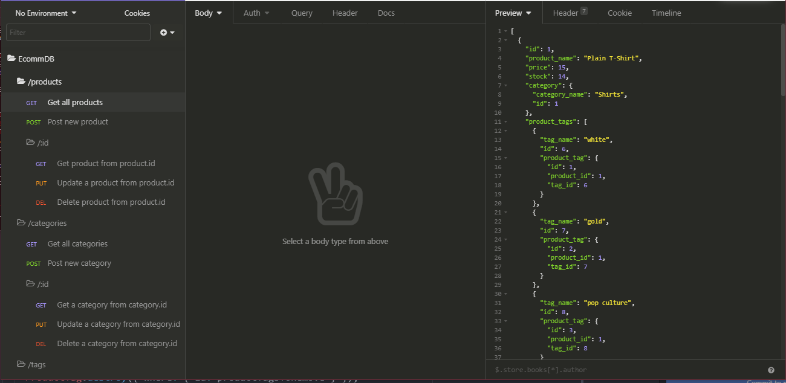

# ECOMM-DB
##### A backend RESTful API to access an E-Commerce Database utilizing sequelize and Node.js
### License
This project does not currently use a license.

---------------
## Table of Contents:
* [Installation](#installation)
* [Usage](#usage)
* [Credits](#credits)
* [Tests](#tests)
* [Questions](#questions)
---------------
## Installation:
1. Download the files and extract to installation folder
2. Run 'npm install'
3. Setup your '.env' file in installation directory to contain the following

`<installation_directory>/.env`
```
DB_NAME='<name of database>'
DB_USER='<username>'
DB_PW='<password>'
RESET_DB='<0 for false, 1 to reset database on server start>'
DEFAULT_PORT='<default port (3001)>'
```
4. Create your database in MySQL with `SOURCE <path-to-installation>/db/schema.sql`
*make sure `<install>/db/schema.sql` uses the correct database name or manually create database in MySQL CLI with DROP/CREATE commands*
5. (Optional) Seed your database by running 'npm run seed'
6. Run 'npm start' to launch your server
## Usage
### API routes:
*JSON Format*
**/categories**

*GET* - Get all categories and their products with their linked tags.

*POST* - With body containing `category_name` to create a new category.

- **/:id**

  *GET* - Return a category and it's products with their linked tags by ID.

  *PUT* - With body containing new `category_name` to update a category name by ID.

  *DELETE* - Delete a category by ID.

**/products**

*GET* - Get all products with their categories and linked tags.

*POST* - With body containing `product_name, price, stock, category_id, tagIds` to add a new product.

- **/:id**

  *GET* - Get product, product's category, and product's linked tags by ID.

  *PUT* - With body containing new values to update a product.

  *DELETE* - Delete a product by ID.

**/tags**

*GET* - Get all tags and their `tagged_products` which contain product info/product category and the `product_tag` that links the tag to a product.

*POST* - With body containing `tag_name` to create a new tag.

- **/:id**

  *GET* - Get a tag with it's `tagged_products` which contain product info/product category and the `product_tag` that links the tag to a product.

  *POST* - With body containing new `tag_name` to update a tag by ID.

  *DELETE* - Delete a tag by ID.



## Credits
[Giamo Lao](https://technicalparadox.github.io)
## Tests
* Seed the database by running 'npm run seed'
* Start the server by running 'npm start'
* Open '`<server-address>`/categories' in your browser and you should see the JSON response containing all categories and their products
## Questions
Any questions should be directed to

[Giamo Lao](https://technicalparadox.github.io)

[giamolao98@gmail.com](mailto:https://technicalparadox.github.io)
